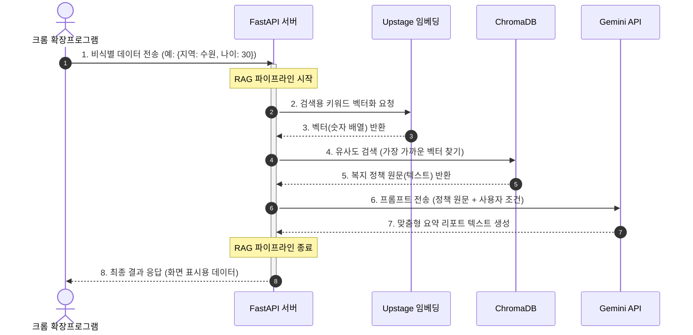

⚙️ Backend (RAG & FastAPI)

복지 정책 원문(PDF, [www.gg.go.kr](https://www.gg.go.kr/bbs/board.do?bsIdx=792&menuId=3298#page=1))을 벡터 데이터베이스에 저장하고, 확장 프로그램의 요청에 따라 관련 정책을 찾아 Gemini를 통해 답변을 생성하는 API 서버입니다.

🌟 백엔드 시스템 흐름도(Sequence Diagram)


🛠️ 기술 스택

Framework: FastAPI (Python 3.10+)

Vector DB: ChromaDB

LLM & Embedding: Upstage (Document Parse, Solar Embedding), Google Gemini API

🚀 로컬 실행 방법

1. 가상환경 설정 및 패키지 설치

```
cd backend
python -m venv .venv
source .venv/bin/activate  # Windows: .venv\Scripts\activate
pip install -r requirements.txt
```


2. 환경 변수 (.env) 설정

backend 폴더 최상단에 .env 파일을 만들고 아래 키를 입력하세요. (절대 GitHub에 커밋하지 마세요!)

```
UPSTAGE_API_KEY="your_upstage_api_key_here"
GEMINI_API_KEY="your_google_gemini_api_key_here"
```


3. 데이터 구축 (Phase 1: Ingestion)

복지 정책 PDF 파일을 ChromaDB에 벡터화하여 저장합니다.
(주의: data/raw/ 폴더에 대상 PDF 파일이 있어야 합니다.)
- 원본 데이터(raw data)가 필요할 경우 PDF 데이터는 [구글 드라이브 링크](https://drive.google.com/drive/folders/1eZRKFwTRSKf1qaMQP0o2aYyMb_kIjzi3?usp=drive_link)에서 다운로드하여 backend/data/raw/에 넣어주세요

```
python scripts/ingest_pdf.py
```


4. API 서버 실행 (Phase 2: Serving)

```
uvicorn app.main:app --reload
```


서버가 실행되면 http://localhost:8000/docs에 접속하여 API 명세서(Swagger UI)를 확인할 수 있습니다.